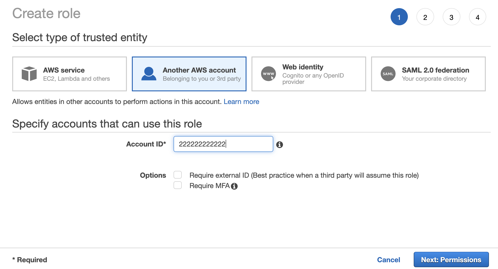
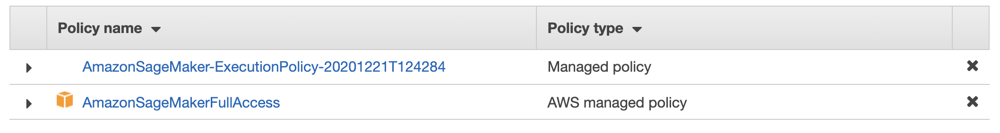

## Using STS to enable cross account access for SageMaker Feature Store

The example notebooks in this repository details the steps needed to enable cross account access for SageMaker Feature Store using an assumed role via [AWS Security Token Service](https://docs.aws.amazon.com/STS/latest/APIReference/welcome.html) (**STS**). For a complete walkthrough of the various SageMaker Feature Store cross account architecture patterns and how to enable feature reuse across accounts and teams, please visit this [AWS blog post](https://aws.amazon.com/blogs/machine-learning/enable-feature-reuse-across-accounts-and-teams-using-amazon-sagemaker-feature-store/). STS is a web service that enables you to request temporary, limited-privilege credentials for AWS Identity and Access Management (IAM) users. STS returns a set of temporary security credentials that you can use to access AWS resources that you might not normally have access to. These temporary credentials consist of an access key ID, a secret access key, and a security token.


### Cross-account access, overview:

To demonstrate this process, let us presume we have two accounts, A and B.

* Account B is the account that maintains a centralized feature store (Online and Offline stores).
* Account A is the account that needs access to both the Online and Offline store contained at account B. 

You can give SageMaker resources (notebooks, endpoints, training jobs)  created in account A permissions to assume a role from account B for the following reasons:

* To access resources, such as S3, Athena and Glue for cross account Offline store access.
* To allow cross account Online store access.


The architecture diagram above shows how account A assumes a role from account B to read and write to both online and offline stores contained within account B. Here is a walkthrough of the 7 steps shown in the diagram:

1.	Account B creates a role that can be assumed by others, in this example, account A.
2.	Account A assumes the role from B via STS role chaining. Account A is now able to generate temporary credentials which can be used to create AWS service clients that would behave as if they are inside account B.
3.	In account A, SageMaker and other service clients (S3, Athena etc.) are created using the temporary credentials via the chained role.
4.	The service clients in account A are now able to create feature groups and populate feature values into account B’s online store using the AWS SDK.
5.	The Online store in account B automatically syncs with the offline store, also in account B.
6.	The Athena service client inside account A runs cross-account queries to read, group and materialize feature sets using Athena tables inside account B. Since the offline store exists in account B, the corresponding Glue tables, metadata catalog entries and the s3 objects all reside within account B. Using STS assume role, account A is able to query the offline features (s3 objects) inside account B.
7.	Athena query results are returned back as feature datasets into account A’s s3 bucket.

### Cross-account access, step by step

This section details all the steps needed to create the cross-account access roles, policies and permissions for enabling shareability of features between accounts A and B as discussed previously. 

#### Inside Account B:

From account B, Create a Feature Store access role: This is the role which AWS services inside account A would assume to gain access to resources in account B.

Under IAM → Create role → Another AWS account, provide the 12-digit account ID of account B as shown below:




Hit Next: Permissions and under Permissions, search and attach the following AWS managed policies:
•	AmazonSageMakerFullAccess
•	AmazonSageMakerFeatureStoreAccess

Additionally, you need to create and attach a custom policy as shown below:

```
{
  "Version": "2012-10-17",
  "Statement": [
    {
      "Sid": "AthenaResultsS3BucketCrossAccountAccessPolicy",
      "Effect": "Allow",
      "Action": [
        "s3:GetBucketLocation",
        "s3:GetObject",
        "s3:ListBucket",
        "s3:PutObjectAcl",
        "s3:PutObject"
      ],
      "Resource": [
        "arn:aws:s3:::<ATHENA RESULTS BUCKET NAME IN ACCOUNT A>/*",
        "arn:aws:s3:::<ATHENA RESULTS BUCKET NAME IN ACCOUNT A>"
      ]
    }
  ]
}

```


`<ATHENA RESULTS BUCKET NAME IN ACCOUNT A>` is the s3 bucket name in account A to which Athena query results collected in account B will be written. When you use the STS cross-account role created above inside account A, it can run Athena queries against the offline store content in account B without being in account B. The custom policy defined above allows Athena (inside account B) to write back the results to a results bucket in account A. Ensure this results bucket is created in account A before creating the policy above.

Once all the policies are attached, hit next and provide a name for this role. For this example, let us name it as `cross-account-assume-role`.

Next, in the Summary page of the created role, under Trust relationships, hit Edit trust relationship and edit the access control Policy Document as shown below. Add SageMaker and Athena to the Principal → Service section of the policy.

**Note**: We had created this cross-account role to be assumed by account A and it is shown as part of the policy below. If you want more external accounts/roles to assume this role, you can add their corresponding ARNs to the Principal section as well.

```
{
  "Version": "2012-10-17",
  "Statement": [
    {
      "Effect": "Allow",
      "Principal": {
        "AWS": [
          "arn:aws:iam::<ACCOUNT A ID>:root"
        ],
        "Service": [
          "sagemaker.amazonaws.com",
          "athena.amazonaws.com"
        ]
      },
      "Action": "sts:AssumeRole",
      "Condition": {}
    }
  ]
}

```


#### **Inside Account A:**

From account A, create a SageMaker notebook instance with an IAM execution role. This role grants SageMaker notebook in account A the needed permissions to execute actions on the feature store inside account B. Alternatively, if you are not using a SageMaker notebook and using AWS Lambda instead, an execution role will need to be created for the Lambda with the same attached policies as shown below.

By default, the following policies are attached when you create a new execution role for a SageMaker notebook. See image below:



We need to create and attach two custom policies in addition to the default ones shown above. First, create a custom policy as shown below which allows the execution role in account A to perform certain S3 actions needed to interact with the offline store in account B.

```
{
  "Version": "2012-10-17",
  "Statement": [
    {
      "Sid": "FeatureStoreS3AccessPolicy",
      "Effect": "Allow",
      "Action": [
        "s3:PutObject",
        "s3:GetBucketAcl",
        "s3:GetObjectAcl"
      ],
      "Resource": [
        "arn:aws:s3:::<OFFLINE STORE BUCKET NAME IN ACCOUNT B>/*",
        "arn:aws:s3:::<OFFLINE STORE BUCKET NAME IN ACCOUNT B>"
      ]
    }
  ]
}
```

Alternatively, you can also attach the AWS managed policy AmazonSageMakerFeatureStoreAccess, if your Offline store S3 bucket name contains the “SageMaker” keyword.

Second, create a custom policy as show below that allows the SageMaker notebook in account A to assume the role (cross-account-assume-role) created in account B.


```
{
  "Version": "2012-10-17",
  "Statement": {
    "Effect": "Allow",
    "Action": "sts:AssumeRole",
    "Resource": "arn:aws:iam::<ACCOUNT B ID>:role/cross-account-assume-role"
  }
}
```

We know account A is the account that is enabled to access the online and offline store in account B. When account A assumes the cross-account STS role of B, it is capable of running Athena queries inside account B against its offline store. However, the results of these queries (feature datasets) will need to be saved in account A’s S3 bucket in order to enable model training. Thus, we need to create a bucket in account A that can store the Athena query results as well as create a bucket policy as shown below. This policy allows the cross-account STS role to write and read objects to this bucket.  

```
{
  "Version": "2012-10-17",
  "Statement": [
    {
      "Sid": "MyStatementSid",
      "Effect": "Allow",
      "Principal": {
        "AWS": [
          "arn:aws:iam::<ACCOUNT B>:role/cross-account-assume-role"
        ]
      },
      "Action": "s3:*",
      "Resource": [
        "arn:aws:s3:::<ATHENA RESULTS BUCKET NAME IN ACCOUNT A>",
        "arn:aws:s3:::<ATHENA RESULTS BUCKET NAME IN ACCOUNT A>/*"
      ]
    }
  ]
}
```

#### **Inside Account B:**

Now, since we had created an execution role in account A, use the ARN of this execution role to modify the trust relationships policy of the cross-account assume role in account B. 

```
{
  "Version": "2012-10-17",
  "Statement": [
    {
      "Effect": "Allow",
      "Principal": {
        "AWS": [
          "ARN OF SAGEMAKER EXECUTION ROLE CREATED IN ACCOUNT A"
        ],
        "Service": [
          "sagemaker.amazonaws.com",
          "athena.amazonaws.com"
        ]
      },
      "Action": "sts:AssumeRole",
      "Condition": {}
    }
  ]
}
```

### Validate the setup process using the notebooks in this repository:

Once all the roles and the accompanying policies are setup as per the instructions detailed above, you can validate the setup by executing the example notebooks contained in this repository. 

Run the notebooks in this order:

1. account-b.ipynb
    * This notebook sets up the centralized feature store (Offline and Online) in account B.
    * Creates a feature group named `customers` and populates it with customer centric features.
    
2. account-a.ipynb
    * This notebook shows how you can assume the feature store access role that you created in account B using STS AssumeRole API call to generate temporary credentials.
    * Next, it shows how to create service clients using the temporary credentials to perform feature store specific actions inside account B from account A.
    * This notebook demonstrates 3 scenarios:
        * Scenario 1 - How to CREATE a feature group inside the centralized feature store (account B) and WRITE/READ features to and from it.
        * Scenario 2 - How to WRITE features to a feature group already located in the centralized feature store (account B).
        * Scenario 3 - How to READ features from a feature group already located in the centralized feature store (account B).
